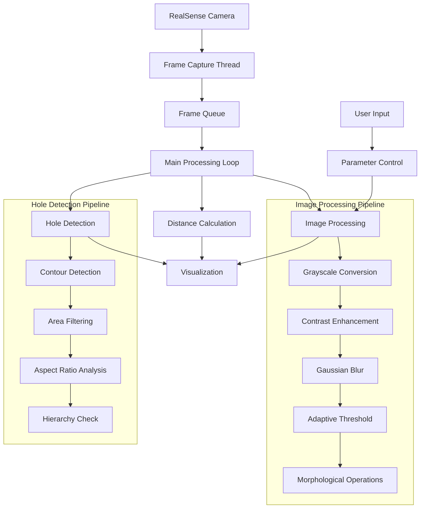
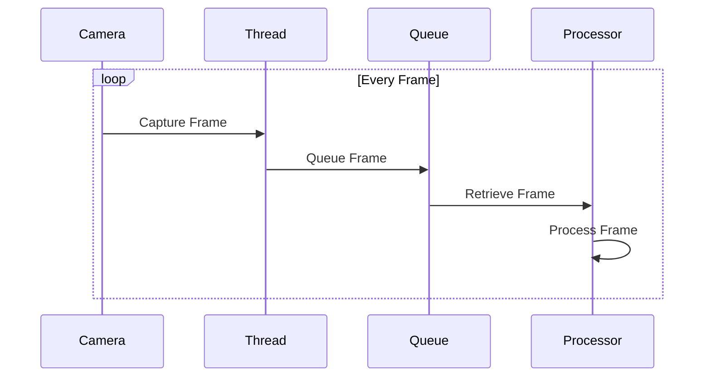

# MeshSense: Real-time Mesh Analysis System


## 📝 Table of Contents
- [Overview](#overview)
- [System Architecture](#system-architecture)
- [Features](#features)
- [How It Works](#how-it-works)
- [Installation](#installation)
- [Usage](#usage)
- [Configuration](#configuration)
- [Technical Details](#technical-details)
- [Author](#author)

## 🎯 Overview

MeshSense is an advanced computer vision system that combines Intel RealSense depth sensing technology with sophisticated image processing algorithms to detect and analyze holes in mesh materials in real-time. The system provides accurate measurements of hole dimensions and their distances from the camera, making it ideal for quality control and analysis applications.

## Regular Image

##Output


## 🏗 System Architecture



## ✨ Features

### Core Capabilities
- **Real-time Hole Detection**: 
  - Automatic detection of holes in mesh materials
  - Size and shape analysis
  - Distance measurements
  - FPS: 15-30 frames per second

### Measurement Tools
- **Distance Calculation**: 
  - Real-time distance measurements
  - Click-to-measure functionality
  - Metric unit display (meters)

### Interactive Controls
- **Keyboard Controls**:
  - 'q': Quit application
  - 's': Save current frame
  - ',' and '.': Adjust contrast
  - '<' and '>': Adjust brightness

### Visual Feedback
- **Real-time Display**:
  - FPS counter
  - Hole count
  - Distance measurements
  - Binary view option
  - Color-coded detection overlay

## 🔬 How It Works

### 1. Image Acquisition


### 2. Hole Detection Pipeline
1. **Pre-processing**:
   - Convert to grayscale
   - Enhance contrast
   - Apply Gaussian blur
   
2. **Detection**:
   - Adaptive thresholding
   - Morphological operations
   - Contour detection

3. **Filtering**:
   ```python
   # Example parameters
   min_area = 20
   max_area = 200
   min_aspect_ratio = 0.5
   max_aspect_ratio = 2.0
   ```

## 📦 Installation

### Prerequisites
- Python 3.8+
- Intel RealSense D400 series camera
- Intel RealSense SDK 2.0

### Setup Steps
1. **Install RealSense SDK**:
   ```bash
   # Ubuntu
   sudo apt-get install librealsense2-dkms librealsense2-utils

   # Windows
   # Download from Intel RealSense website
   ```

2. **Install Python Dependencies**:
   ```bash
   pip install pyrealsense2 opencv-python numpy
   ```

3. **Clone Repository**:
   ```bash
   git clone https://github.com/yourusername/meshsense.git
   cd meshsense
   ```

## 🎮 Usage

1. **Start Application**:
   ```bash
   python camera_viewer.py
   ```

2. **Basic Controls**:
   - Left-click: Measure distance to point
   - 'q': Quit
   - 's': Save frame
   - ',' and '.': Adjust contrast
   - '<' and '>': Adjust brightness

## ⚙️ Configuration

### Detection Parameters
```python
params = {
    'min_area': 20,          # Minimum hole area
    'max_area': 200,         # Maximum hole area
    'threshold': 70,         # Base threshold
    'blur_size': 3,          # Blur kernel size
    'contrast': 1.4,         # Contrast enhancement
    'brightness': 30,        # Brightness adjustment
    'grid_size': 15,         # Expected mesh grid size
    'dilate_size': 2,        # Morphological operation size
}
```

## 👤 Author

* **Md Khairul Islam**
   * Institution: Hobart and William Smith Colleges, Geneva, NY
   * Major: Robotics and Computer Science
   * Contact: khairul.islam@hws.edu

## 📄 License

This project is licensed under the MIT License. See the LICENSE file for details.

## 🙏 Acknowledgments

- Intel RealSense Team
- OpenCV Community
- Python Community

## 📚 References

1. Intel RealSense SDK: https://dev.intelrealsense.com/docs/
2. OpenCV Documentation: https://docs.opencv.org/
3. Python Threading: https://docs.python.org/3/library/threading.html
